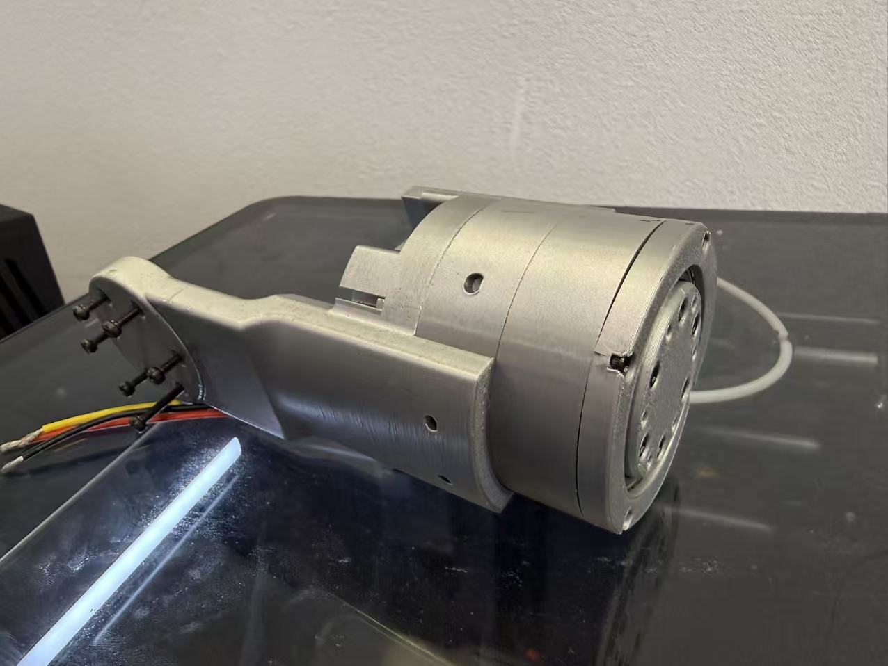

# Berkeley-robot-joint-optimization0.2
伯克利关节优化开源
伯克利关节在初代设计的基础上，进行了革命性的传动结构优化。其核心在于采用了高精度双摆线齿轮减速机构，替代了传统的行星齿轮或谐波减速方案。

  
  
传动结构的升级：双摆线结构通过共轭的摆线齿形啮合，实现了多齿同时接触。这不仅带来了更大的输出扭矩，其固有的误差均化效应还极大地降低了传动背隙。

运行流畅性：在实际动态负载测试中，优化的传动结构有效抑制了低速爬行现象，并减少了转矩脉动。这使得关节电机在启动、换向及匀速运行时，速度曲线更为平滑，表现为卓越的“运行流畅性”，有效提升了末端执行器的轨迹精度。

刚性增强：更大的减速比与坚固的啮合结构，带来了更高的抗冲击能力和轴向/径向刚度，关节在应对突发外力时表现出更小的形变，提升了整体机器人系统的动态响应性能与控制稳定性。

Berkeley Joint Optimization Open source
Based on the first-generation design, Berkeley joints have undergone revolutionary optimization of the transmission structure. The core lies in the adoption of a high-precision double cycloidal gear reduction mechanism, which replaces the traditional planetary gear or harmonic reduction schemes.
Upgrade of the transmission structure: The double cycloidal structure achieves simultaneous contact of multiple teeth through the meshing of conjugate cycloidal tooth profiles. This not only brings about a greater output torque, but also its inherent error equalization effect greatly reduces the transmission backlash.
Smoothness of operation: In actual dynamic load tests, the optimized transmission structure effectively suppresses low-speed crawling and reduces torque ripple. This makes the speed curve of the joint motor smoother during startup, reversing and uniform operation, demonstrating outstanding "operational smoothness" and effectively enhancing the trajectory accuracy of the end effector.
Enhanced rigidity: A larger reduction ratio and a robust meshing structure bring about higher impact resistance and axial/radial rigidity. The joints exhibit less deformation when responding to sudden external forces, thereby improving the dynamic response performance and control stability of the overall robot system.

  
  
 
## 致谢
感谢项目组成员岳国文，田宇鑫在项目迭代与数据处理中做出的贡献，感谢张东老师在项目方案上的精准指导，也感谢项目组其他成员的通力协作。

## 加入社区

  
  
